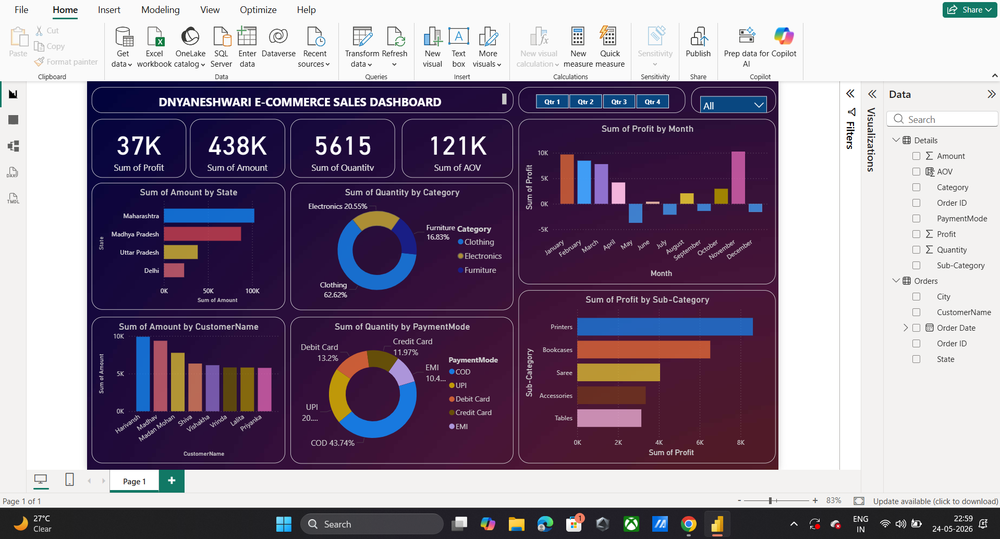

# E-COMMERCE-SALES-DASHBOARD

Interactive Power BI E-Commerce Sales Dashboard analyzing sales, profit, quantity, customer insights, payment modes, and monthly performance using dynamic visualizations and filters.

## Project Overview
This dashboard helps analyze e-commerce sales performance and business insights using interactive visualizations.

## Key Insights
- Total Sales Analysis
- Profit Analysis
- Monthly Sales Trends
- Customer Insights
- Payment Mode Analysis
- Quantity Analysis

## Tools & Technologies
- Power BI
- Excel
- DAX
- Data Visualization

## Dashboard Screenshot

